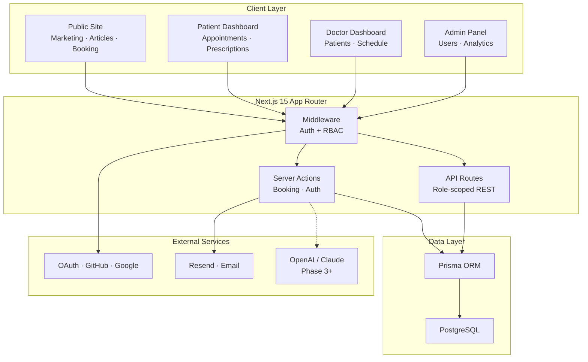

# Maha AI — Holistic Wellness Platform

> **Production-grade full-stack healthcare platform** built with Next.js 15, TypeScript, and PostgreSQL — designed for multi-role telehealth, appointment orchestration, and AI-assisted wellness.

[](https://nextjs.org/)
[](https://react.dev/)
[](https://www.typescriptlang.org/)
[](https://www.prisma.io/)
[](https://authjs.dev/)

---

## Why this project?

Healthcare platforms demand more than CRUD — they need **role isolation, audit trails, consent tracking, and secure data flows** across patients, clinicians, and admins. Maha AI demonstrates end-to-end ownership of a complex domain: from authentication and RBAC middleware to a multi-step booking engine, role-specific dashboards, and a content system with SEO — all architected for scale.

Built as a **modular, batch-organized codebase** (~100+ TypeScript modules) that maps cleanly onto a Next.js App Router structure — the kind of system design you'd ship on a product team, not a tutorial todo app.

---

## Highlights for reviewers

| Area | What it shows |
|------|----------------|
| **System design** | Three-tier role model (Patient / Doctor / Admin) with middleware-enforced route guards and server-side permission checks |
| **Domain modeling** | 15+ Prisma entities — appointments, consultations, prescriptions, medical reports, consent & audit logs |
| **Booking engine** | 5-step wizard with Zod validation, real-time slot availability, server actions, and email notifications |
| **API layer** | RESTful routes scoped per role (`/api/patient/*`, `/api/doctor/*`, `/api/admin/*`) |
| **Security posture** | bcrypt hashing, JWT sessions, CSRF protection, audit logging, consent tracking |
| **Content & SEO** | Article CMS with categories, slugs, metadata, and reusable card components |
| **Future-ready** | Roadmapped AI phases — symptom triage, RAG knowledge base, consultation copilot |

---

## Architecture



---

## Tech stack

| Layer | Technologies |
|-------|-------------|
| **Framework** | Next.js 15 (App Router), React 19, TypeScript |
| **Styling** | Tailwind CSS, shadcn/ui, Radix UI |
| **Database** | PostgreSQL, Prisma ORM |
| **Auth** | Auth.js (NextAuth v5) — Credentials, Google, GitHub |
| **Validation** | Zod, React Hook Form |
| **Email** | Resend |
| **Payments** | Stripe (planned) |
| **Deployment** | Vercel, Railway / Supabase (DB) |

---

## Features

### Authentication & authorization
- Multi-provider login (email/password, Google, GitHub)
- JWT session management with secure HTTP-only cookies
- Role-based access control (RBAC) with `requirePatient`, `requireDoctor`, `requireAdmin` guards
- Middleware route protection for `/dashboard`, `/doctor`, `/admin`
- Password reset flow and unauthorized access handling

### Appointment booking
- 5-step booking wizard: personal info → concern → doctor → schedule → confirm
- 7 consultation types (Homeopathy, Pediatrics, Fertility, Women's Wellness, and more)
- Doctor filtering by specialization with ratings and fees
- Dynamic 14-day availability with real-time slot checking
- Server actions: book, reschedule, cancel, feedback
- Confirmation emails with video call meeting codes

### Role-based dashboards

**Patient**
- Dashboard stats overview
- Appointment history and status tracking
- Digital prescription viewer

**Doctor**
- Practice analytics and appointment management
- Assigned patient list with health summaries
- Prescription and consultation tools

**Admin**
- User management (verify doctors, suspend accounts)
- Platform-wide appointment analytics
- Content and system oversight

### Content & SEO
- Article listing with category filters
- Dynamic `[slug]` detail pages with Open Graph metadata
- Featured articles component for homepage
- Doctor-authored wellness content pipeline

### Compliance & observability
- `AuditLog` — entity-level change tracking with IP and user agent
- `ConsentLog` — privacy/terms acceptance with versioning
- `Notification` system for appointment lifecycle events
- Account status validation and last-login tracking

---

## Project structure

This repo ships **production modules organized by feature batch**, ready to integrate into a Next.js project:

```
Maha AI wellness platform/
├── shared/           # Auth, middleware, RBAC, dashboard pages, routing
├── ui/               # Auth UI — login, register, guards, providers
├── backend-api/      # Dashboard pages + role-scoped API routes
├── ai-services/      # Appointment booking wizard, validation, actions
├── docs/             # Article CMS, SEO components, content APIs
├── STARTER_PROJECT.md
└── shared/ROADMAP_TO_AI_WELLNESS_PLATFORM.md
```

Each batch includes a setup guide (`BATCH_*_SETUP.md`) with copy paths into a standard Next.js App Router layout.

---

## Database schema (high level)

```
User ──┬── PatientProfile ── Appointments, Consultations, Prescriptions
       ├── DoctorProfile  ── Appointments, Articles, Prescriptions
       └── AuditLog, ConsentLog, Notifications

Appointment ── Consultation ── Prescription / MedicalReport
Article ── Category
```

Full schema: 15+ models with indexed fields for `email`, `role`, `status`, `scheduledAt`, and `slug`. See `STARTER_PROJECT.md` for the complete Prisma definition.

---

## API overview

| Endpoint | Role | Description |
|----------|------|-------------|
| `GET /api/patient/dashboard-stats` | Patient | Dashboard metrics |
| `GET /api/patient/appointments` | Patient | Appointment list |
| `GET /api/patient/prescriptions` | Patient | Active prescriptions |
| `GET /api/doctor/dashboard-stats` | Doctor | Practice analytics |
| `GET /api/doctor/appointments` | Doctor | Schedule management |
| `GET /api/doctor/patients` | Doctor | Assigned patients |
| `GET /api/admin/dashboard-stats` | Admin | Platform metrics |
| `GET /api/admin/users` | Admin | User management |
| `GET /api/admin/appointments` | Admin | All appointments |
| `GET /api/doctors?specialization=` | Public | Doctor directory |
| `GET /api/doctors/:id/availability` | Public | Time slot availability |
| `GET /api/articles` | Public | Article listing + filters |
| `GET /api/articles/categories` | Public | Content categories |

---

## Getting started

### Prerequisites
- Node.js 20+
- PostgreSQL 14+
- npm or pnpm

### Quick setup

```bash
# 1. Scaffold the Next.js app
npx create-next-app@latest wellness-platform --typescript --tailwind --eslint
cd wellness-platform

# 2. Install core dependencies
npm install @prisma/client next-auth@beta bcryptjs zod react-hook-form @hookform/resolvers resend

# 3. Clone this repo and copy modules (see batch setup guides)
#    shared/BATCH_2_AUTH_SETUP.md
#    backend-api/BATCH_3_DASHBOARDS_SETUP.md
#    ai-services/BATCH_4_BOOKING_SETUP.md
#    docs/BATCH_5_ARTICLE_SYSTEM.md

# 4. Configure environment
cp .env.example .env.local
# Set DATABASE_URL, NEXTAUTH_SECRET, OAuth keys, RESEND_API_KEY

# 5. Initialize database
npx prisma db push && npx prisma generate

# 6. Run
npm run dev
```

Visit `http://localhost:3000`

### Test accounts (after seed)

| Role | Email | Password |
|------|-------|----------|
| Patient | patient@test.com | password123 |
| Doctor | doctor@test.com | password123 |
| Admin | admin@test.com | password123 |

---

## Roadmap

| Phase | Focus | Status |
|-------|-------|--------|
| **0 — MVP** | Auth, booking, dashboards, CMS | ✅ Complete |
| **1** | Medical profiles, video consults, reminders | Planned |
| **2** | Doctor analytics, consultation tools | Planned |
| **3** | AI symptom checker, RAG knowledge base, chatbot | Planned |
| **4–5** | Fertility & pediatric specialized modules | Planned |
| **6–8** | Community, AI copilot, enterprise integrations | Planned |

Full 52-week roadmap: [`shared/ROADMAP_TO_AI_WELLNESS_PLATFORM.md`](shared/ROADMAP_TO_AI_WELLNESS_PLATFORM.md)

---

## What I'd discuss in an interview

- **Why middleware + server-side RBAC?** Defense in depth — client guards are UX; server checks are security.
- **Why server actions for booking?** Colocated mutations, type-safe validation, no extra API boilerplate.
- **How would this scale?** Read replicas for dashboards, Redis for slot locking, queue for email/notifications.
- **Healthcare compliance path?** Audit logs and consent tracking are MVP foundations; HIPAA hardening in Phase 8.

---

## Author

**Your Name** · Full-Stack Engineer · 4+ years experience  
Building production systems across React, Node.js, and cloud-native architectures.

[](#) · [](#) · [](#)

---

## License

MIT — free to use for learning and portfolio purposes.

---

<p align="center">
  <sub>Built with intent — not just another CRUD demo.</sub>
</p>
